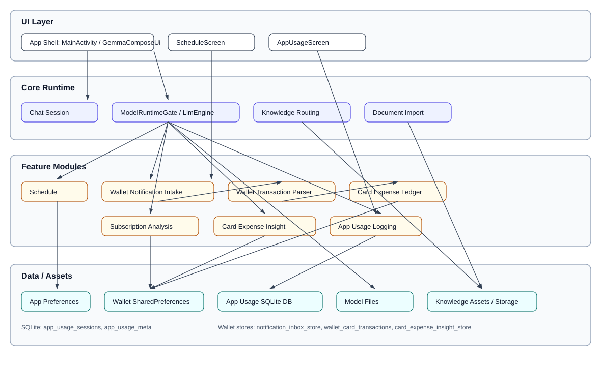

# WalletMate

LiteRT-LM 기반 온디바이스 금융 도우미 Android 앱입니다.  
현재 프로젝트는 `홈`, `카드 사용내역`, `일정`, `채팅 세션`, `모델 런타임`, `지식 문서 라우팅`, `문서 업로드`, `빌드/에셋`, `삼성 Wallet 알림 분석` 모듈로 나뉩니다.

이 README는 전체 인덱스 역할만 합니다. 상세 동작은 모듈별 문서를 먼저 읽는 것이 효율적입니다.

## 협업 문서

- `project.md`: 작업 현황판
- `AGENTS.md`: Codex 관리자 지침
- `CLAUDE.md`: Claude 실무 지침
- `business_context.md`: 제품과 비즈니스 맥락
- `design.md`: 디자인 원칙
- `docs/collab_protocol.md`: Codex와 Claude 협업 프로토콜
- `docs/agent_runtime.md`: Codex가 Claude를 자동 호출할 때의 실행 규칙
- `docs/template.md`: 작업 지시 및 보고 템플릿

자동 위임을 실제로 쓰려면 `claude` CLI 인증이 먼저 필요합니다. 첫 실행 전 `claude auth login --claudeai` 또는 적절한 인증 방식을 완료해야 합니다.

## 로컬 파일 정책

- `local.properties`, `.claude/`, `.codex/`, `.gradle/`, `.idea/`, `build/` 산출물은 Git에 올리지 않는다.
- 로컬에서만 쓰는 모델 파일(`*.litertlm`)은 기본적으로 Git 추적 대상에서 제외한다.
- 개인 이메일, 로컬 SDK 경로, 개별 사용자 계정 식별자는 코드나 문서에 하드코딩하지 않는다.

## 전체 구조

```text
.
├── app/
│   ├── build.gradle.kts
│   └── src/main/
│       ├── AndroidManifest.xml
│       ├── assets/
│       │   └── knowledge/
│       ├── java/com/example/gemma4ondevicetest/
│       │   ├── MainActivity.kt
│       │   ├── GemmaComposeUi.kt
│       │   ├── LlmEngine.kt
│       │   ├── ModelStore.kt
│       │   ├── AgentRouter.kt
│       │   ├── KnowledgePromptBuilder.kt
│       │   ├── ManifestLoader.kt
│       │   ├── DocumentImporter.kt
│       │   ├── ChatSessionStore.kt
│       │   └── schedule/
│       └── res/
├── docs/
│   ├── agent_runtime.md
│   └── modules/
│       ├── app-shell.md
│       ├── chat-session.md
│       ├── model-runtime.md
│       ├── knowledge-routing.md
│       ├── document-import.md
│       ├── schedule.md
│       ├── build-assets.md
│       ├── wallet-notification-intake.md
│       ├── wallet-transaction-parser.md
│       ├── card-expense-ledger.md
│       └── wallet-expense-feature.md
├── scripts/
│   └── claude_handoff.sh
└── ARCHITECTURE.md
```

## Module View



PlantUML source: `docs/diagrams/module-view.puml`

## 모듈 문서

- `app-shell`: 화면 전환, 전역 상태, 액션 연결
- `chat-session`: 세션/메시지 저장과 응답 흐름
- `model-runtime`: 모델 선택, 다운로드, 런타임 로드
- `knowledge-routing`: manifest 기반 지식 선택과 프롬프트 주입
- `document-import`: txt 업로드와 사용자 지식 문서 등록
- `schedule`: 캘린더 조회, 일정 요약, 알림 실행
- `build-assets`: Gradle, manifest, 번들 모델, 스크립트
- `wallet-notification-intake`: NotificationListenerService 기반 수집 경계
- `wallet-transaction-parser`: 삼성 Wallet 알림 문구에서 카드 사용 데이터 추출
- `card-expense-ledger`: 거래 저장, 중복 제거, 집계
- `wallet-expense-feature`: 기능 전체 오케스트레이션과 구현 순서

## 요구사항별로 먼저 볼 파일

| 요구사항 | 먼저 볼 문서 | 핵심 파일 |
|---|---|---|
| 앱 시작 흐름, 홈/카드/일정/채팅 화면 이동, 전역 상태 수정 | `docs/modules/app-shell.md` | `MainActivity.kt`, `GemmaComposeUi.kt` |
| 채팅 세션 저장 방식, 응답 생성 흐름 수정 | `docs/modules/chat-session.md` | `ChatSessionStore.kt`, `MainActivity.kt`, `LlmEngine.kt` |
| 모델 선택, 다운로드, 로드 실패 수정 | `docs/modules/model-runtime.md` | `ModelStore.kt`, `LlmEngine.kt`, `MainActivity.kt` |
| 지식 문서 선택 기준, 금융 문서 응답 품질 수정 | `docs/modules/knowledge-routing.md` | `AgentRouter.kt`, `ManifestLoader.kt`, `KnowledgePromptBuilder.kt`, `assets/knowledge/manifest.json` |
| 문서 업로드, 섹션 분리, 사용자 문서 저장 수정 | `docs/modules/document-import.md` | `DocumentImporter.kt`, `ManifestLoader.kt`, `MainActivity.kt` |
| 캘린더 권한, 일정 표시, 알림 요약 수정 | `docs/modules/schedule.md` | `CalendarReader.kt`, `SchedulePromptBuilder.kt`, `ScheduleWorker.kt`, `ScheduleWorkScheduler.kt` |
| 빌드 설정, asset 포함, 모델 번들링 수정 | `docs/modules/build-assets.md` | `app/build.gradle.kts`, `AndroidManifest.xml`, `scripts/download_function_gemma.sh` |
| 삼성 Wallet 알림 수집 구현 | `docs/modules/wallet-notification-intake.md` | `AndroidManifest.xml`, `MainActivity.kt`, `wallet/WalletNotificationListenerService.kt` |
| 삼성 Wallet 알림에서 카드 금액 파싱 구현 | `docs/modules/wallet-transaction-parser.md` | `wallet/WalletNotificationParser.kt`, `wallet/WalletNotificationModels.kt` |
| 카드 거래 저장/월별 합계/중복 제거 구현 | `docs/modules/card-expense-ledger.md` | `wallet/CardTransactionStore.kt`, `wallet/CardExpenseRepository.kt` |
| 기능 전체 연결 순서와 화면 반영 | `docs/modules/wallet-expense-feature.md` | `MainActivity.kt`, `GemmaComposeUi.kt`, `wallet/*` |

## 빠른 읽기 순서

1. `README.md`
2. 요구사항에 맞는 `docs/modules/*.md`
3. `ARCHITECTURE.md`
4. 실제 코드 파일

## 현재 시스템 요약

- 앱은 `홈 -> 카드 사용내역 / 일정 / 채팅` 진입 구조를 가지며, UI와 오케스트레이션은 `MainActivity.kt`에 많이 집중되어 있습니다.
- 모델 추론은 `LlmEngine.kt` 하나가 세션별 `Conversation`을 관리합니다.
- 지식 응답은 현재 Function Calling이 아니라 키워드 매칭 기반 라우팅입니다.
- 업로드한 문서는 앱 내부 저장소와 override manifest로 병합됩니다.
- 일정 기능은 별도 `schedule` 패키지로 분리되어 있습니다.
- 삼성 Wallet 알림 분석 기능은 아직 미구현이며, 문서로 먼저 모듈 경계를 정의한 상태입니다.
- 삼성 Wallet 기능은 AI 없이 알림 수집, 규칙 기반 파싱, 당월 집계만으로 설계합니다.

## 상세 문서

- `docs/modules/app-shell.md`
- `docs/modules/chat-session.md`
- `docs/modules/model-runtime.md`
- `docs/modules/knowledge-routing.md`
- `docs/modules/document-import.md`
- `docs/modules/schedule.md`
- `docs/modules/build-assets.md`
- `docs/modules/wallet-notification-intake.md`
- `docs/modules/wallet-transaction-parser.md`
- `docs/modules/card-expense-ledger.md`
- `docs/modules/wallet-expense-feature.md`
- `docs/agent_runtime.md`
- `ARCHITECTURE.md`
